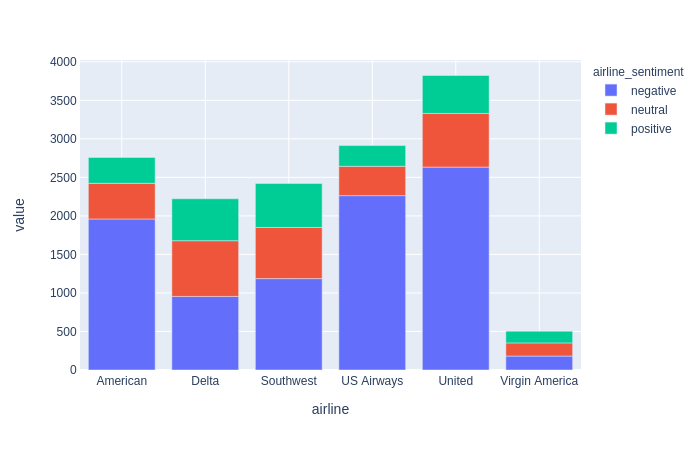

# Assignment 3 - Data Analysis

* Assessment weight: 25% of the total unit assessment.

In this assignment you will provide data analysis within the context of a business application. The assignment is designed so that it can be completed using Python tools and visualisation software introduced during the lectures and workshops of the unit.

## Topic: Analysis of opinions of airline companies.

We will use the following Kaggle dataset, which contains tweets of people expressing their feelings about several airlines:

* https://www.kaggle.com/crowdflower/twitter-airline-sentiment
* [Offline version](Tweets.csv)

Each tweet contains the text of the tweet, the airline, and the sentiment expressed (positive, neutral, negative), plus other information that you may find useful. The kaggle webpage also includes some analysis of the data made by several contributors. Look at the "Kernels" tab. The dataset is designed to train predictors of sentiment analysis but we will not do this in the assignment, so many of the contributions will not be relevant to this assignment.

This assignment is divided in several tasks. Each task addresses a question that you need to answer by writing Python code, producing one or more charts, and explaining how the chart(s) answer(s) the question. Some of the tasks will tell you exactly what kind of chart you need to produce, but other tasks will only express a need for some information and you need to decide what chart or set of charts would help find the information.

Your report must be structured using the task titles as headings. Each section must contain the following subheadings or equivalent:

* **Chart** (or **Charts** when appropriate), where you insert the Python code that generates the charts, and the charts. Make sure that the charts have the appropriate titles and legends. 
* **Discussion**, where you explain how the chart(s) can be used to answer the question asked in the task.

## Task 1 (5 marks) - How many tweets per sentiment and airline?

To complete this task, simply reproduce this stacked bar chart. You still need to explain how you produced the chart, and how to read it in order to answer the question.

(*hint: the chart was made using [plotly express](https://plotly.com/python/plotly-express/)*)

## Task 2 (5 marks) - What are the most common causes of dissatisfaction in each company?

You can use the column "negativereason" of the dataset to answer this question. You need to decide the type of chart of charts and explain why these charts are suitable. Make sure that the chart or charts really help to answer the question, and explain how to interpret them.

## Task 3 (5 marks) - For each airline company, what are the most frequent words in negative sentiments?

To complete this task, create a **word cloud** for each airline company using the text of the tweets expressing negative sentiments about the airline. When you build the word clouds, make sure that the words displayed are informative. For example, remove stop words, and remove mentions to the airline.

Write your interpretation of the word clouds.

## Task 4 (5 marks) - What are the most common opinions expressed?

To complete this task, you need to perform **topic modelling** in order to identify the main topics of the opinions expressed in the tweets. For example, you can perform Latent Dirichlet Allocation. Present the results in the appropriate chart or charts, and write how the charts answer the question of this task. To perform topic modelling you normally need to specify the number of topics. In your report, write how you determined the number of topics. For example, did you try with different numbers of topics and choose the number that reported most satisfactory results? If so, how did you determine the most satisfactory results?

## Task 5 (5 marks) - Provide useful additional information.

This final task is open. Provide additional charts that would help the analyst find additional useful information about the sentiments expressed by the twitters.

You will obtain full marks if the additional charts present information that is truly different from the information presented in the previous charts. For example, presenting the most frequent words in positive sentiments will **not** give full marks (because it's very similar to task 3). Or using a bar chart instead of word clouds to express the most frequent words in negative (or positive) sentiments will **not** give full marks.

You need to show off your ability to find and represent additional information, based on what we have covered in this unit. Information that can be found and displayed very easily (e.g. what's the longest review? what is the airline with the most comments?) will **not** give full marks.

## Submission

There are two submission boxes.
* **Turnitin submission**: In this submission box, submit your report as a PDF file. This file can be your Python notebook exported to PDF. **Do not submit your Python .ipynb file here.**
* **Code submission**: In this submission box, submit your Python notebook with all the code that generated the PDF report. Make sure that we understand how the code can produce the charts and other analysis results described in the PDF report.

**Penalty for late submission: 2.5 marks per day late (or part thereof).** This represents 10% of the total available as indicated in the [unit guide](https://unitguides.mq.edu.au/unit_offerings/129599/unit_guide#general-assessment-section).

## A note about plagiarism

By submitting this assignment you acknowledge that it is your own work and that you did not copy material from other people or the web. There are penalties for plagiarism. 