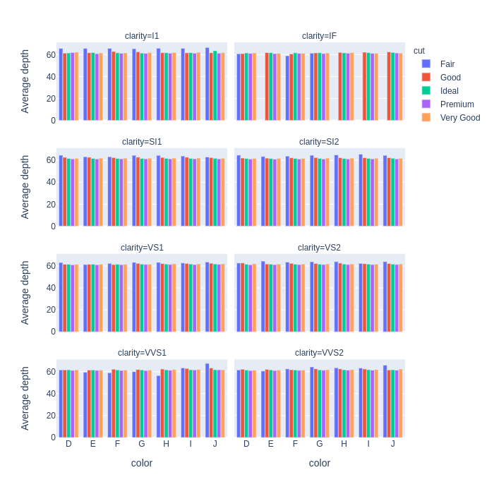

# Workshop Week 11 - Visual Analytics

In this workshop you will conduct visual analytics in Python. We will use the diamonds data set from https://www.kaggle.com/shivam2503/diamonds :

* [diamonds.csv.zip](diamonds.csv.zip)

For inspiration of how to visualise the contents of this data set, look at these Kaggle notebooks. In particular, look at those tagged with "visualization" or "exploratory data analysis":

https://www.kaggle.com/shivam2503/diamonds/notebooks

In all of the plots that you generate in the following exercises, make sure that the plot represents the information clearly. To achieve this you may need to override the defaults and change the labels of the x and y axis, the labels of the legends, re-order the elements in bar charts, etc.

To generate the plots you can use any of these plotting libraries in Python. All of the plots in the exercises can be done with Plotly except when otherwise stated:

- Plotly and plotly express (https://plotly.com/)
- Matplotlib (https://matplotlib.org/)
- Seaborn (https://seaborn.pydata.org/)
- Your favourite library

## 1. Visualise each column (20 minutes + 10 minutes discussion)

Visualise each column of the diamonds data set. For the numerical columns, use a histogram. For the categorical columns, use a bar chart.

## 2. Parallel plots (30 minutes + 10 minutes discussion)

Generate parallel plots that show the distribution of the diamond depth for each diamond colour. In particular, generate the following plots:

1. Parallel box plots as illustrated below.

2. Parallel violin plots.

3. Bar chart, where each bar represents the mean of the diamond depth for that particular diamond color.

4. Bar char that also includes error bars. The bar indicates the mean of the diamond depth, and the error bar indicates the standard deviation. Below is an illustration.

5. Scatterplot with jittering in the x axis as illustrated below (note: this cannot be done with plotly; you can use Seaborn instead)

## 3. Scatterplots of large data sets (30 minutes + 10 minutes discussion)

We want to plot the price vs. the carat of the diamonds data set. Produce the following plots:

1. Scatterplot of all the samples (x axis: price; y axis: carat) as demonstrated in the lecture notebook. The figure should look like this:

2. Modify the scatterplot so that each marker has an opacity of 0.1

3. Reduce the size of the marker. Experiment with various sizes until you achieve an effective visualisation.

4. Generate a contour density plot for each diamond colour as illustrated in this figure.

5. Instead of plotting all the samples, select a random sample of a reduced number, and plot them with your choice of plots among the above. Reason whether a random sample is better, and experiment with various samples until you obtain the most effective plot.

## 4. OPTIONAL Plot with multiple information (20 minutes + 10 minutes discussion)

Try to produce plots that contain the following information:

1. Scatterplots of price vs carat for every combination of cut and color, for example as shown below.

2. The average depth of all samples with same cut and colour. You can achieve this with a grouped bar plot.

3. The average depth of all samples with same cut, colour, and transparency. You can achieve this with a grouped bar plot with facets as illustrated below.

